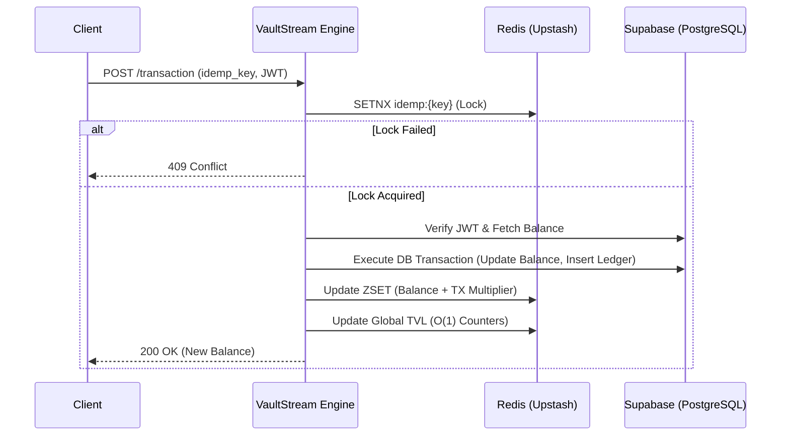

<div align="center">
  
  <h1><b>VaultStream</b></h1>
  <p><i>A high-throughput, concurrent financial ledger engine designed for absolute precision.</i></p>

  
  
  
  
  
  <br />
  <br />

</div>

<hr />

## 📖 Overview

**VaultStream** is an institutional-grade financial ledger and ranking engine. It handles high-frequency concurrent transactions while calculating live, multi-factor leaderboards in real-time. Built with a focus on **absolute data integrity**, **idempotency**, and a **premium user experience**, VaultStream bridges the gap between mathematically rigorous backends and beautifully fluid frontends.

<br />

## ✨ Key Features

<dl>
  <dt>🛡️ Atomic Serialization & Idempotency</dt>
  <dd>Guarantees absolute account balance integrity during simultaneous multi-client execution states. Utilizes distributed Redis locks (<code>idemp_key</code>) to automatically prevent race-condition vulnerabilities and duplicate processing.</dd>

  <dt>⚡ O(1) Real-Time Ranking Engine</dt>
  <dd>Employs Redis Sorted Sets (<code>ZSET</code>) combined with an algorithmic multiplier <code>balance + (tx_count * 10.0)</code> to rank users instantly based on both liquidity and network activity.</dd>

  <dt>🔐 Stateless Verification & Security</dt>
  <dd>Utilizes decentralized, cryptographically signed JWT access tokens via Supabase Auth. Authentication is proxied through our FastAPI backend to enforce strict Redis-based rate limiting (e.g., 3 failed login attempts trigger an immediate 5-minute lockout) and prevent bot flooding on registration endpoints.</dd>

  <dt>💎 Premium Institutional UI</dt>
  <dd>A completely monochromatic, glassmorphic design system utilizing Framer Motion for liquid transitions, 3D tilt cards, and a sophisticated typography stack (Cormorant Garamond & Geist Mono).</dd>
</dl>

<br />

## 🏗️ System Architecture

VaultStream utilizes a decoupled, event-driven architecture. The FastAPI backend orchestrates strict PostgreSQL transactions via Supabase, while utilizing Redis as a rapid-access caching and locking layer.



<br />

## 🗄️ Database Schema (PostgreSQL)

The primary datastore runs on Supabase (PostgreSQL) with Strict Row Level Security (RLS).

| Table | Primary Key | Attributes | Description |
| :--- | :--- | :--- | :--- |
| `public.users` | `id` (UUID) | `username` (Text), `balance` (Numeric), `tx_count` (Int) | Stores the absolute state of user identities and balances. Links directly to Supabase Auth. |
| `public.transactions` | `id` (UUID) | `user_id` (UUID), `amount` (Numeric), `type` (Enum: CREDIT/DEBIT), `idemp_key` (Text) | Immutable append-only ledger for all network actions. |

<br />

## 🚀 Installation & Setup

### 1. Clone the repository
```bash
git clone https://github.com/your-username/vaultstream.git
cd vaultstream
```

### 2. Backend Setup (FastAPI)
```bash
cd backend
python -m venv venv
source venv/Scripts/activate  # (Windows)
pip install -r requirements.txt

# Create a .env file and add your Supabase and Redis credentials
# SUPABASE_URL=...
# SUPABASE_SERVICE_KEY=...
# REDIS_URL=...

uvicorn app.main:app --reload
```

### 3. Frontend Setup (React + Vite)
```bash
cd frontend
npm install

# Create a .env file with your Supabase Anon Key
# VITE_SUPABASE_URL=...
# VITE_SUPABASE_ANON_KEY=...

npm run dev
```

<br />

## 💡 Use Cases

VaultStream's core logic can be seamlessly adopted for various high-performance domains:
1. **High-Frequency Trading Dashboards:** Where balances and transaction limits must be strictly enforced with zero latency.
2. **Gaming Leaderboards:** Where players are ranked globally based on a combination of resources (balance) and engagement (transactions).
3. **Institutional Banking Simulations:** For demonstrating robust database concurrency, distributed locking, and zero-trust security layers.

<br />

## 🔮 Future Scope

While VaultStream currently acts as a robust V1.0 ledger, the architecture is primed for expansion:
- **Kafka / RabbitMQ Integration:** Transitioning the HTTP-based ledger inserts into an asynchronous event stream for massive horizontal scalability.
- **WebSocket Live Feed:** Broadcasting transaction events globally to all connected clients to display a live scrolling ticker of network activity.
- **Advanced Graph Analytics:** Utilizing D3.js or Recharts to visualize user transaction velocity and liquidity flow over time.

<hr />

<div align="center">
  <p>Built with precision.</p>
</div>
