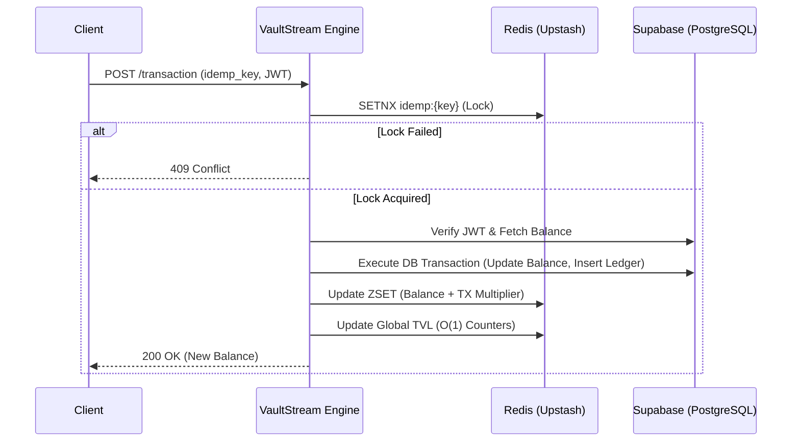

<div align="center">
  
  <h1><b>VaultStream</b></h1>
  <p><i>A high-throughput, concurrent financial ledger engine designed for absolute precision.</i></p>

  
  
  
  
  
  <br />
  <br />

</div>

<hr />

## 📖 Overview

**VaultStream** is an institutional-grade financial ledger and ranking engine. It handles high-frequency concurrent transactions while calculating live, multi-factor leaderboards in real-time. Built with a focus on **absolute data integrity**, **idempotency**, and a **premium user experience**, VaultStream bridges the gap between mathematically rigorous backends and beautifully fluid frontends.

<br />

## ✨ Key Features

<dl>
  <dt>🛡️ Atomic Serialization & Idempotency</dt>
  <dd>Guarantees absolute account balance integrity during simultaneous multi-client execution states. Utilizes distributed Redis locks (<code>idemp_key</code>) to automatically prevent race-condition vulnerabilities and duplicate processing.</dd>

  <dt>⚡ O(1) Real-Time Ranking Engine</dt>
  <dd>Employs Redis Sorted Sets (<code>ZSET</code>) combined with an algorithmic multiplier <code>balance + (tx_count * 10.0)</code> to rank users instantly based on both liquidity and network activity.</dd>

  <dt>🔐 Stateless Verification & Security</dt>
  <dd>Utilizes decentralized, cryptographically signed JWT access tokens via Supabase Auth. Authentication is proxied through our FastAPI backend to enforce strict Redis-based rate limiting (e.g., 3 failed login attempts trigger an immediate 5-minute lockout) and prevent bot flooding on registration endpoints.</dd>

  <dt>💎 Premium Institutional UI</dt>
  <dd>A completely monochromatic, glassmorphic design system utilizing Framer Motion for liquid transitions, 3D tilt cards, and a sophisticated typography stack (Cormorant Garamond & Geist Mono).</dd>
</dl>

<br />

## 🏗️ System Architecture

VaultStream utilizes a decoupled, event-driven architecture. The FastAPI backend orchestrates strict PostgreSQL transactions via Supabase, while utilizing Redis as a rapid-access caching and locking layer.



<br />

## ⚙️ How the APIs Work

VaultStream exposes a set of RESTful APIs built with FastAPI, designed for high speed and asynchronous execution:

1. **Authentication APIs (`/auth/register`, `/auth/login`, `/auth/check-username`)**
   - Handles user registration and JWT generation via Supabase Auth.
   - Proxies the auth requests through the backend to enforce strict Redis-based rate limiting (preventing brute force and bot attacks).
   
2. **Transaction API (`/transaction`)**
   - The core engine endpoint. Accepts a transaction type (`CREDIT` or `DEBIT`), an `amount`, and an `idemp_key`.
   - Validates the user's JWT token securely.
   - Evaluates the current balance (rejecting overdrafts).
   - Updates the PostgreSQL database and Redis cache simultaneously.

3. **Ranking & Stats APIs (`/ranking`, `/stats/tvl`)**
   - Fetches the top 100 global accounts from the Redis `ZSET` cache in O(1) time complexity.
   - Returns system-wide statistics like Total Value Locked (TVL) and Total Transactions without ever hitting the main SQL database.

<br />

## 🏆 How Ranking is Calculated

To determine the global leaderboard, VaultStream uses a hybrid formula that rewards both account balance and network activity:

**Score = `Account Balance` + (`Transaction Count` × 10.0)**

- **Balance:** The primary metric for wealth.
- **Transaction Count:** An engagement metric. Every time a user interacts with the system (sending/receiving), their score gets a boost (e.g., 10 points per transaction).
- **Execution:** Instead of running heavy SQL `ORDER BY` queries on millions of rows, the score is calculated asynchronously and stored in a **Redis Sorted Set (ZSET)**. This allows the frontend to retrieve the top 100 users instantly.

<br />

## 🛡️ Preventing Duplicate Requests (Concurrency)

In financial systems, a common attack vector or glitch is a user double-clicking a "Submit" button, resulting in double-charges. VaultStream prevents this using **Idempotency Keys**:

1. **Client-Side Generation:** Every time a user initiates a transaction, the frontend generates a unique UUID (the `idemp_key`).
2. **Redis Distributed Locking:** The backend receives the request and immediately tries to save the `idemp_key` in Redis using `SETNX` (Set if Not eXists) with a 30-second expiration.
3. **Rejection:** If the key already exists in Redis, it means a request with that ID is already being processed. The backend instantly rejects the duplicate request with a `409 Conflict` error.
4. **Result:** A user can click "Withdraw" 50 times in one second, but only the very first request will ever be processed.

<br />

## 🗄️ Database Schema (PostgreSQL)

The primary datastore runs on Supabase (PostgreSQL) with Strict Row Level Security (RLS).

| Table | Primary Key | Attributes | Description |
| :--- | :--- | :--- | :--- |
| `public.users` | `id` (UUID) | `username` (Text), `balance` (Numeric), `tx_count` (Int) | Stores the absolute state of user identities and balances. Links directly to Supabase Auth. |
| `public.transactions` | `id` (UUID) | `user_id` (UUID), `amount` (Numeric), `type` (Enum: CREDIT/DEBIT), `idemp_key` (Text) | Immutable append-only ledger for all network actions. |

<br />

## 🚀 Installation & Setup

### 1. Clone the repository
```bash
git clone https://github.com/your-username/vaultstream.git
cd vaultstream
```

### 2. Backend Setup (FastAPI)
The backend requires Python 3.9+.

```bash
cd backend
python -m venv venv
source venv/Scripts/activate  # (Windows) or `source venv/bin/activate` (Mac/Linux)
pip install -r requirements.txt

# Create a .env file and add your credentials
# SUPABASE_URL=your_supabase_project_url
# SUPABASE_SERVICE_ROLE_KEY=your_supabase_service_role_key
# REDIS_URL=your_redis_connection_string
# FRONTEND_URL=http://localhost:5173

# Run the server on http://localhost:8000
uvicorn app.main:app --reload
```

### 3. Frontend Setup (React + Vite)
The frontend requires Node.js.

```bash
cd frontend
npm install

# Create a .env file with your local backend URL and Supabase Anon Key
# VITE_API_URL=http://localhost:8000
# VITE_SUPABASE_URL=your_supabase_project_url
# VITE_SUPABASE_ANON_KEY=your_supabase_anon_key

# Run the development server on http://localhost:5173
npm run dev
```

<br />

## 💡 Use Cases

VaultStream's core logic can be seamlessly adopted for various high-performance domains:
1. **High-Frequency Trading Dashboards:** Where balances and transaction limits must be strictly enforced with zero latency.
2. **Gaming Leaderboards:** Where players are ranked globally based on a combination of resources (balance) and engagement (transactions).
3. **Institutional Banking Simulations:** For demonstrating robust database concurrency, distributed locking, and zero-trust security layers.

<br />

## 🔮 Future Scope

While VaultStream currently acts as a robust V1.0 ledger, the architecture is primed for expansion:
- **Kafka / RabbitMQ Integration:** Transitioning the HTTP-based ledger inserts into an asynchronous event stream for massive horizontal scalability.
- **WebSocket Live Feed:** Broadcasting transaction events globally to all connected clients to display a live scrolling ticker of network activity.
- **Advanced Graph Analytics:** Utilizing D3.js or Recharts to visualize user transaction velocity and liquidity flow over time.

<hr />

<div align="center">
  <p>Built with precision.</p>
</div>
